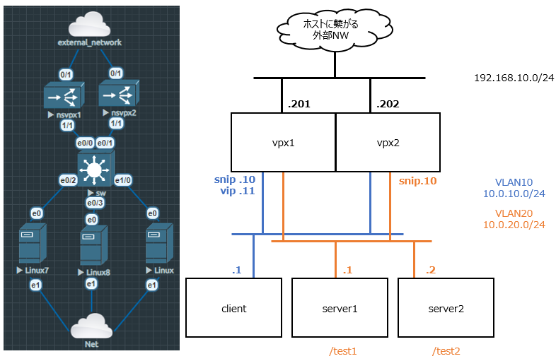

# Contents Switching
## 0. はじめに
コンテンツスイッチは、同じvipにアクセスしてきた場合でもリクエストの内容によって転送先のサーバを変更することができる機能です。

今回のトポロジは以下で進めていきます。  
**http:/10.0.10.11/test1** でアクセスした場合は **server1** へ  
**http:/10.0.10.11/test2** でアクセスした場合は **server2** へ  
振り分けていきます。  

  

## 1. VPXの設定

