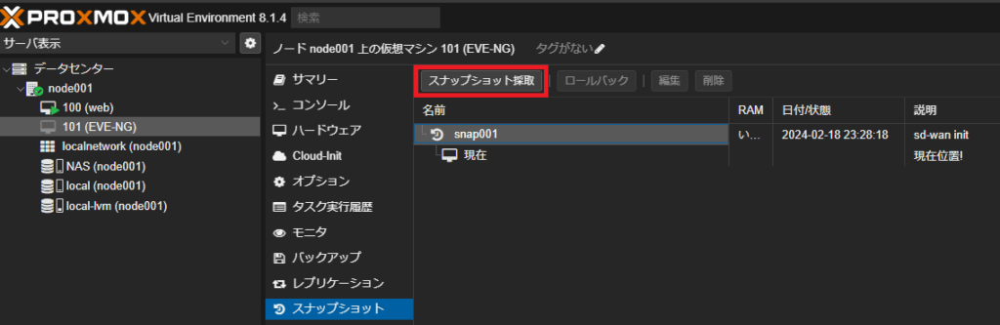
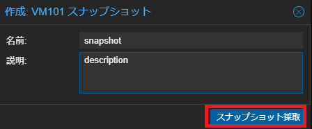
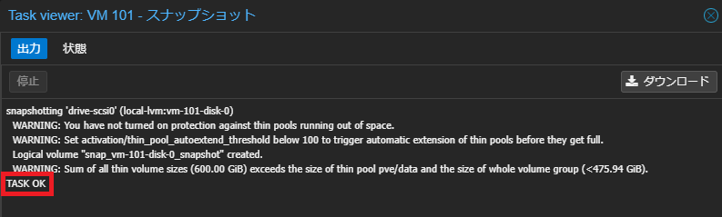
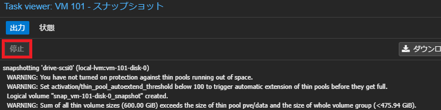
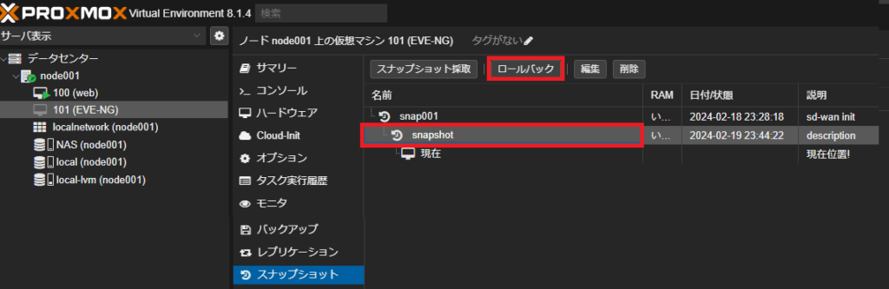
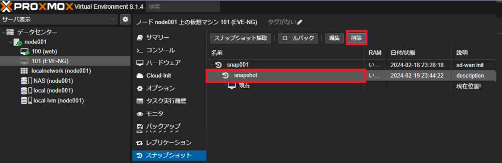

# Snapshot
## 0. はじめに
今回はsnapshotの取り方、削除の仕方を紹介します。

<br><br>

## 1. Snapshotの取得

管理画面でsnapshotを取る対象のVM画面に遷移し、スナップショット採取をクリックします。
  

snapshot名とその説明を入力し、スナップショット採取をクリックします。
  

TASK OKが出たら完了です。
  

停止をクリックすることで、途中で停止することもできます。
  

<br><br>

## 2. 指定Snapshotへのロールバック

ロールバックしたいsnapshotを選択し、ロールバックをクリックします。
  

<br><br>

## 3. Snapshotの削除

削除したいsnapshotを選択し、削除をクリックします。
  

途中で停止した場合、VMがロックされている場合があります。  
その場合は、proxmoxのshellに入り、以下コマンドでアンロックします。
```
qm unlock <vmid>
```

また、snapshotがvolumeから削除済みにも関わらずconfファイルにゴミが残り、削除時に以下エラーが出る場合があります。  
> Failed to find logical volume "pve/snap\_vm-<vmid>-disk-0\_<snapshot名>"  

その場合は、vmのconfファイルから\[snapshot名\]以下を削除します。
```
vi /etc/pve/qemu-server/<vmid>.conf
```
