# Deploy EVE-NG
## 0. はじめに
前回構築したproxmox上にEVE-NGのVMを建てます。  
私は主にCCIE用に使用しており、メモリを50GB程度割り振ればDNACを除いたフルラボ構成で十分使用できるかと思います。  
また、IOS以外にもJuniperやfortinet等の各種ベンダOSが動作するので、普段の業務での確認にも使いやすいかと思います。  

<br><br>

## 1. ISOダウンロード

ここからeve-ngのISOイメージをダウンロードします。

[https://www.eve-ng.net/index.php/download/](https://www.eve-ng.net/index.php/download/)
  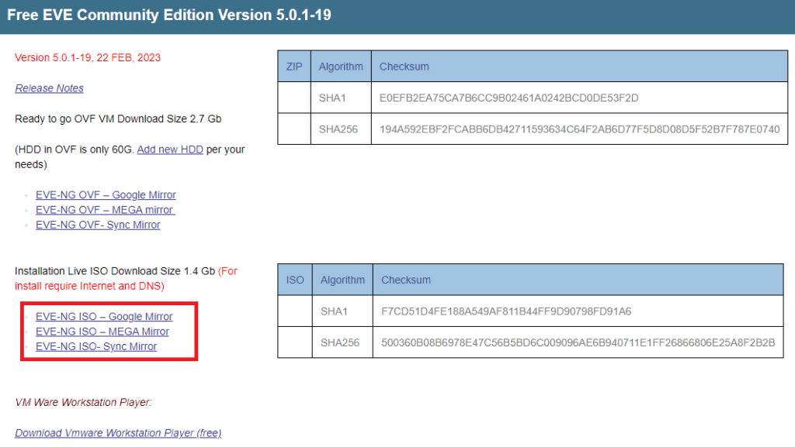

<br><br>

## 2. Proxmox上でVMを作成

次にproxmox側で管理画面右上の「VMを作成」をクリックし、VMを作成します。

  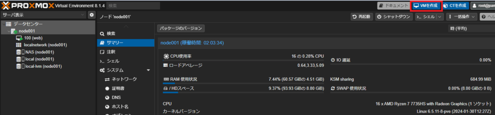

VMの名前を入力します。

  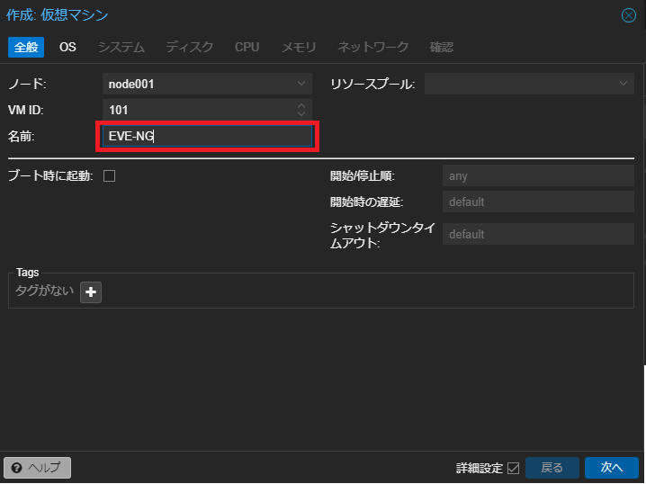

ダウンロードしてきたISOイメージを選択します。

  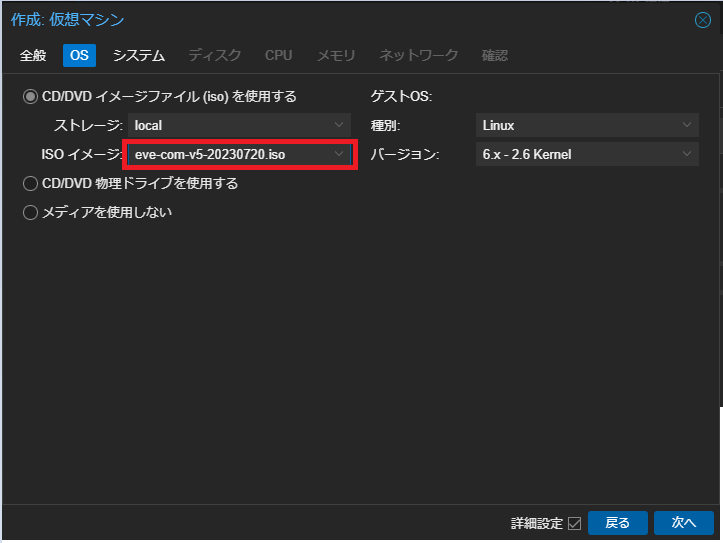

管理画面上から リモートでVMをshutdownできるように、Qemuエージェントを追加します。

  

VMが使用するストレージとサイズを選択します。

  

使用するCPUのコア数を選択します。  
また、EVE-NGではネストされた仮想環境になるので種別をhostにします。

  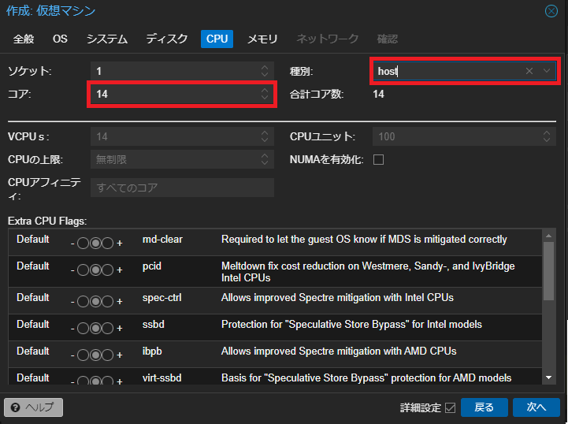

使用するメモリサイズを指定します。

  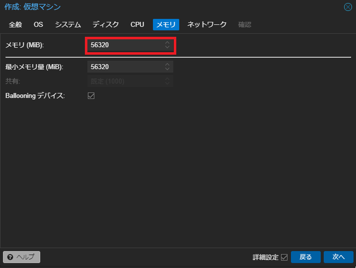

ネットワークの設定はデフォルトのブリッジを使用します。

  

nested virtualizationを有効にします。  
proxmoxホスト上で、シェルを開きます。

  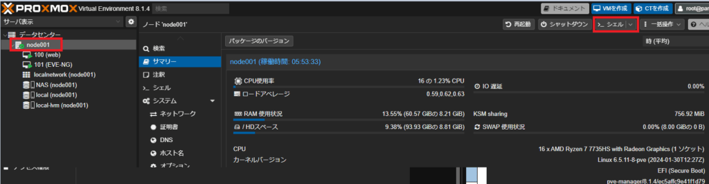

シェル上で、以下コマンドでnestedが有効かどうか確認します。デフォルトで有効だと思います。

・Intel CPUの場合(有効ならY)
```
cat /sys/module/kvm_intel/parameters/nested
```

・amd CPUの場合(有効なら1)
```
cat /sys/module/kvm_amd/parameters/nested
```

以下コマンドでcpu typeを固定します。vmidはproxmox管理画面上のVM名の左に記載されている番号になります。

```
qm set <vmid> --cpu host
```

  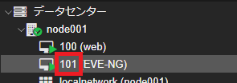

<br><br>

## 3. EVE-NGのインストール

作成したVMを起動し、EVE-NGのインストールを進めていきます。

  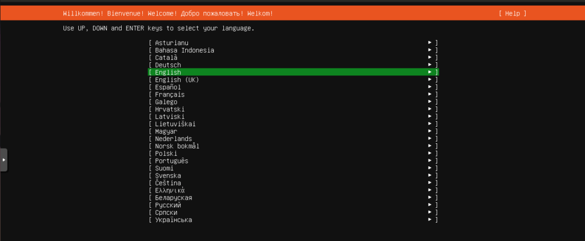

デフォルトのままDone。

  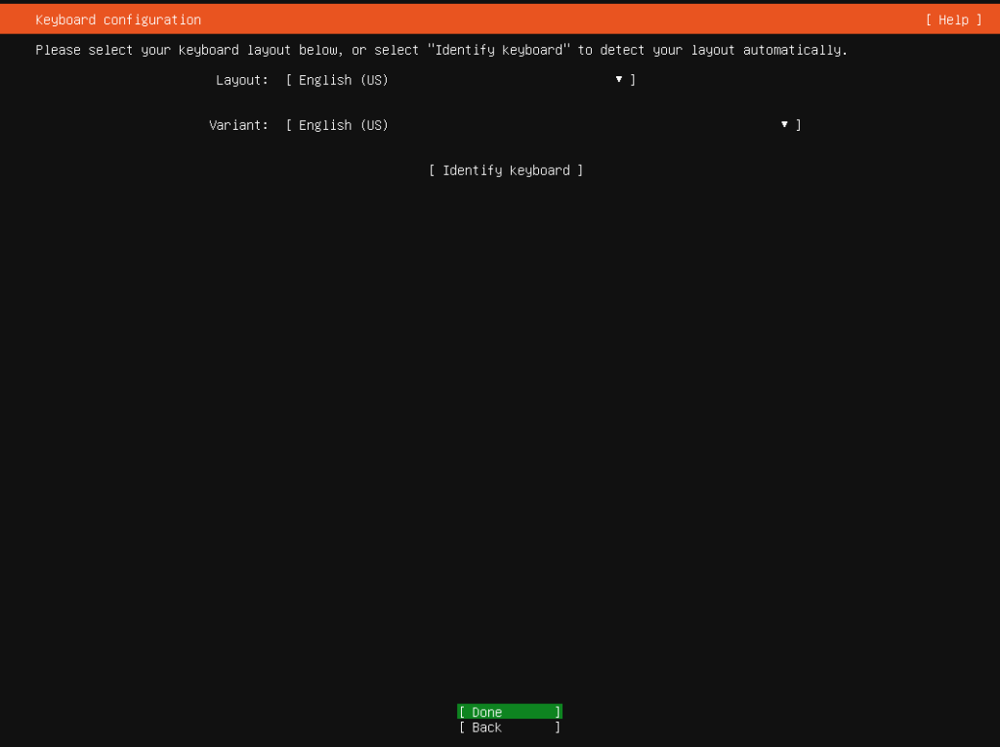

VM作成時にブリッジを選択しているので、今回はproxmoxと同セグメントにします。

  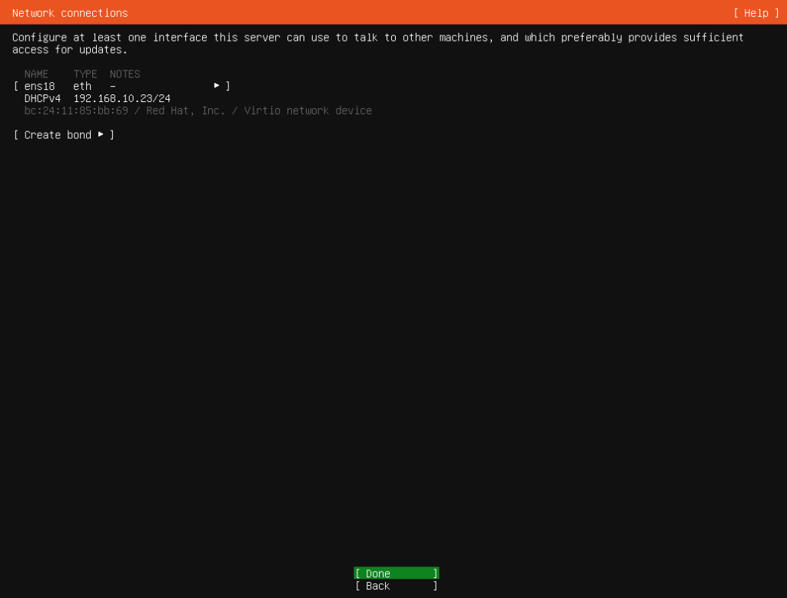

今回はproxyを使用しないので、そのままDone。

  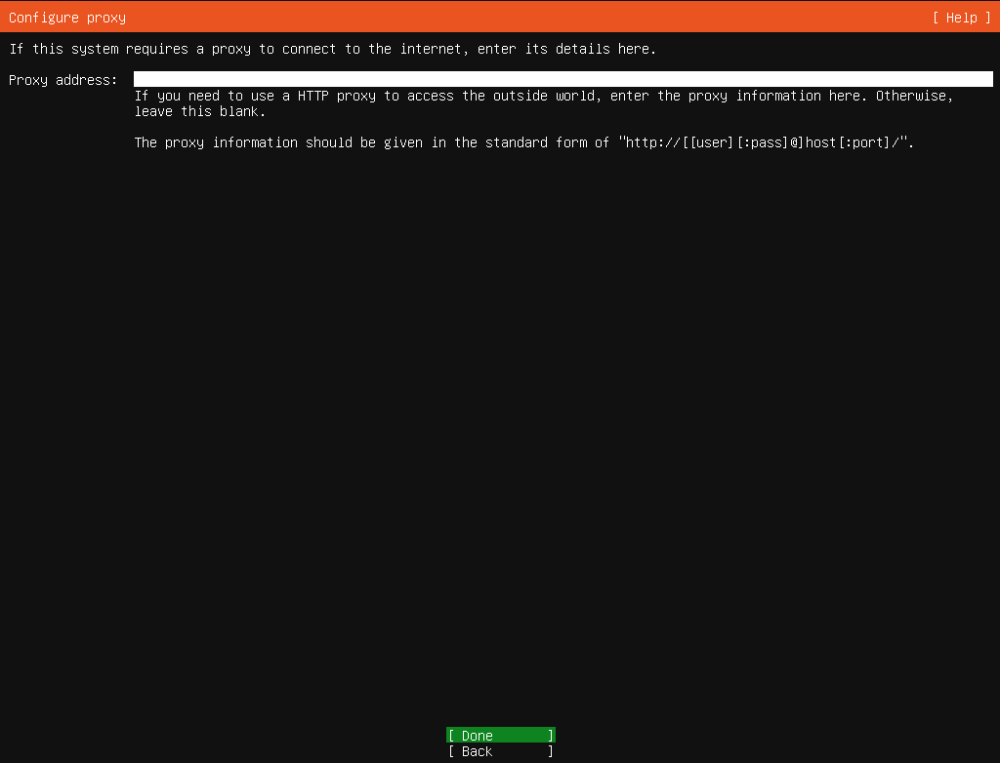

Continueを選択。

  

Install completeとなったら、proxmox上で作成したVMのISOドライブを解除します。  
CD/DVDドライブをダブルクリックし、メディアを使用しないを選択。

  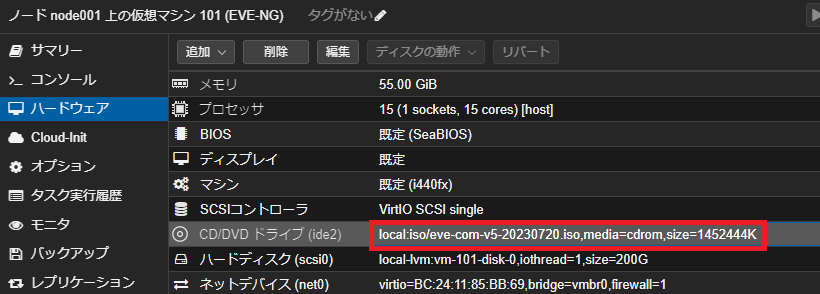
  

VMに戻り、Reboot Nowで再起動します。

  

再起動後、root/eveでログインします。  
初期ログイン後はsetup画面が表示されます。

  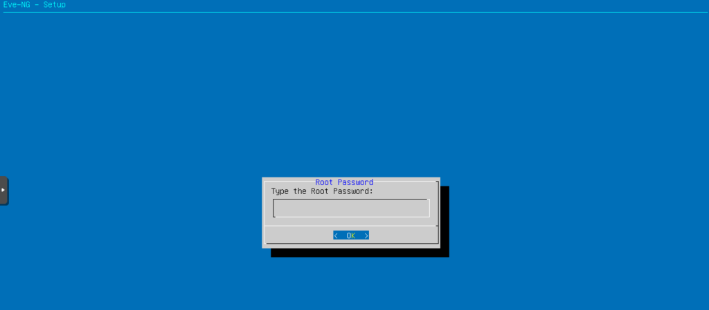

eve-ngに実際にログインするIPを設定します。  
今回はDHCPにしますが、固定で振りたい場合はstaticを選択します。

  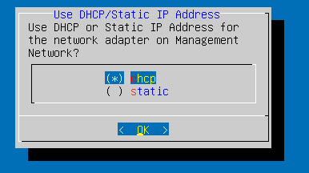

proxyを使用しないのでdirect connectionにします。

  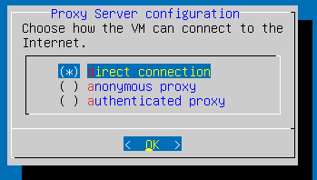

設定完了後、起動するとhttp://<設定したIP>/ が表示されるので、ブラウザに入力しログイン。

  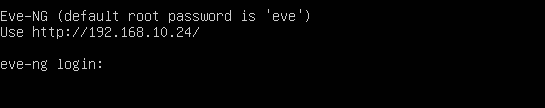

admin/eveでログインできます。

  

このままだと、proxmox上からshutdownが出来ないので、eve-ngのCLI上でqemu-guest-agentをインストールします。  

```
apt update
apt install qemu-guest-agent
```

以上になります。
